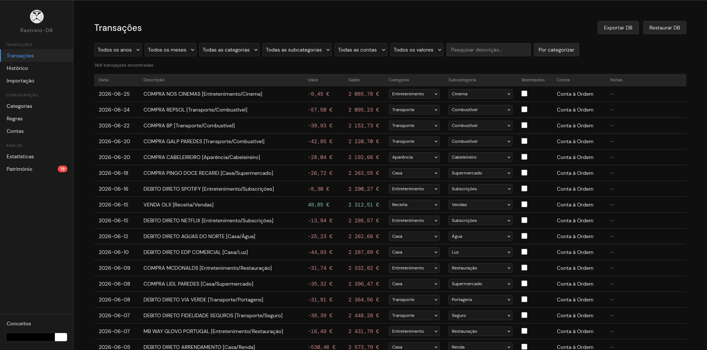
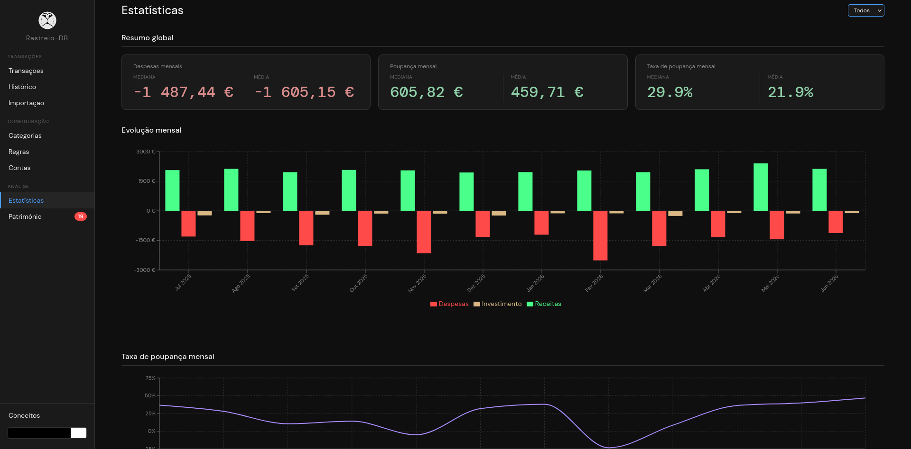
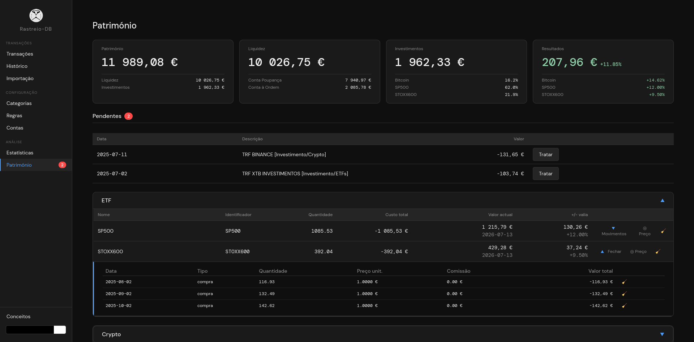
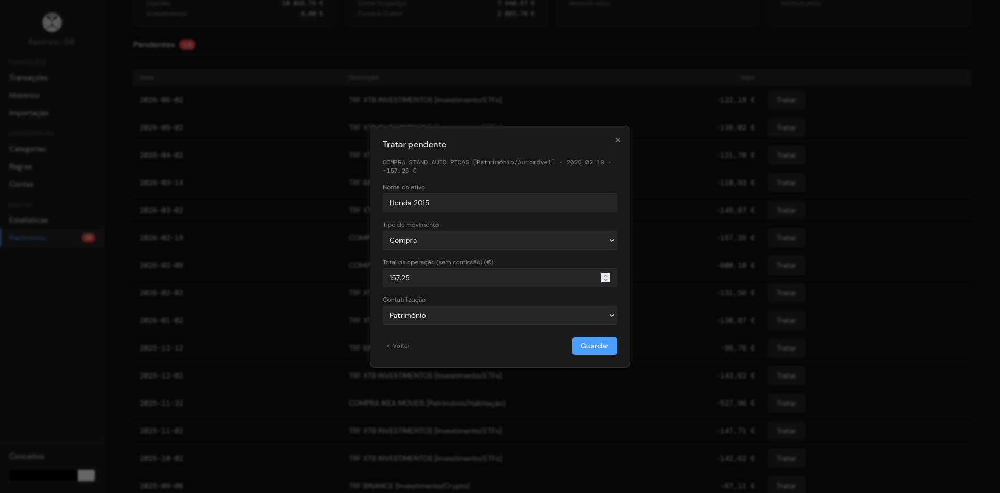
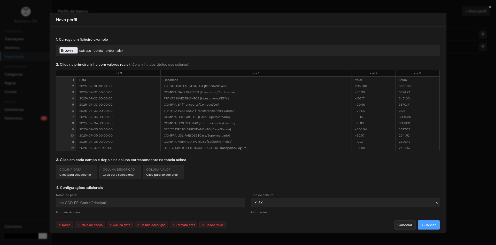
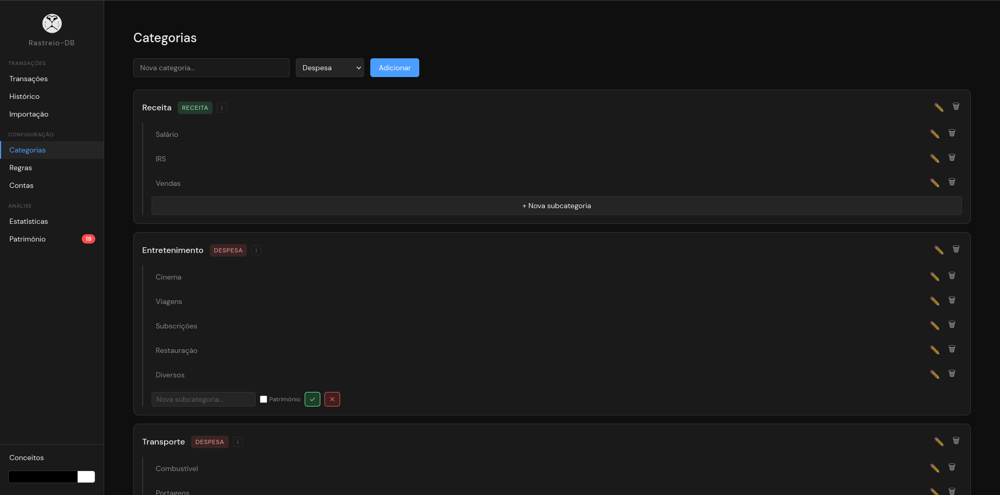
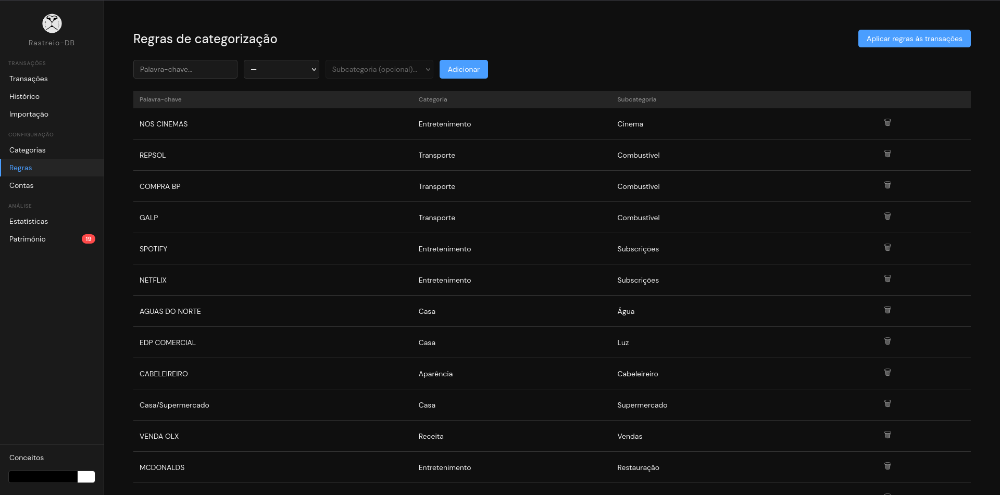
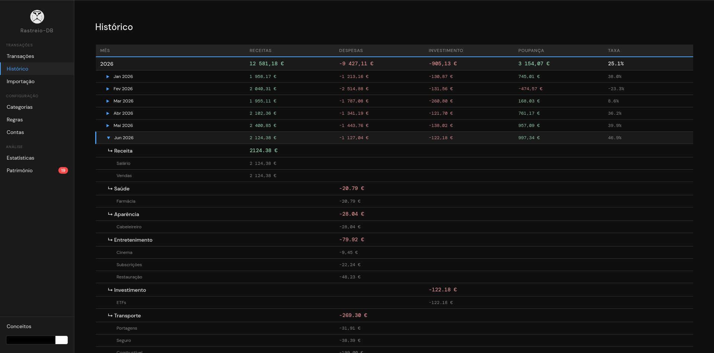
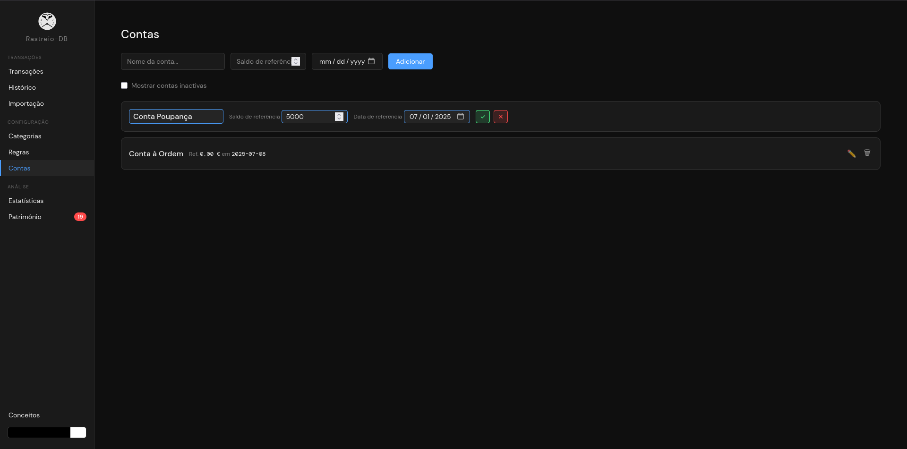

  

# Rastreio-DB

  <a href="https://github.com/pedro-f-97/rastreio-db/releases/latest">⬇️ Download da versão mais recente</a>

  <strong>Python • FastAPI • React • SQLite • SQLAlchemy • PyInstaller</strong>

Aplicação web para gestão e análise de despesas bancárias pessoais. Permite importar extratos bancários em Excel, categorizar transações automaticamente com regras configuráveis e acompanhar a evolução financeira através de estatísticas detalhadas — com detalhes por categoria, taxa de poupança e totalizadores anuais e absolutos.

## Motivação

O Excel como ferramenta de controlo financeiro acumula limitações que se tornam progressivamente mais frustrantes, este projeto nasceu da necessidade de algo mais robusto e adequado ao problema.

## Preview

### Transações (edição inline + filtros)

### Estatísticas (evolução mensal, distribuição por categoria, taxa de poupança)

### Património (activos, valorização, FIFO)

Mais screenshots (Importação, Categorias, Regras, Histórico, Contas)

### Importação (mapeamento de colunas + deteção de duplicados)

### Categorias

### Regras de categorização automática

### Histórico (totais por ano/mês, drill-down por categoria)

### Contas

## Funcionalidades

### Transações
- **Transações** — listagem paginada com edição inline de categoria, subcategoria, reembolso e notas; filtros por ano, mês e categoria; filtro rápido de transações por categorizar; categorização automática por regras de substring com sugestões de novas regras; aplicação de regras em massa com resolução individual de conflitos
- **Histórico** — totais agregados por ano e mês, com drill-down por categoria dentro de cada mês
- **Importação** — suporte a Excel e CSV, com perfis de mapeamento de colunas configuráveis por banco e detecção automática de duplicados por `data + descrição + valor + saldo`

### Configuração
- **Categorias** — CRUD completo com definição de tipo (`despesa`, `receita`, `investimento`, `transferencia`) e subcategorias opcionais
- **Regras** — regras de categorização automática por correspondência de substring
- **Contas** — CRUD de contas bancárias

### Análise
- **Estatísticas** — resumo mensal, gráfico de evolução, médias e medianas por categoria, distribuição com drill-down para subcategorias, taxa de poupança e totalizadores anuais
- **Património** — acompanhamento de activos com movimentos, valorização ao longo do tempo e totais por tipo

### Geral
- Tema claro/escuro com persistência entre sessões
- Backup e restauro da base de dados com auto-backup de segurança antes de cada restauro
- Ecrã de primeiro uso com inicialização opcional de categorias predefinidas, seguido de tour guiado interativo pela interface
- Página de Conceitos — explicação das principais áreas da aplicação (Contas/Importação/Transações, Categorias, Regras, Património), com opção de reiniciar o tour guiado

## Categorias

As categorias e subcategorias são totalmente configuráveis. Cada categoria tem um `tipo` que determina o seu papel nas estatísticas:

| Tipo | Papel nas estatísticas |
|---|---|
| `despesa` | Incluída nos totais de despesa e nas médias por categoria |
| `receita` | Incluída nos totais de receita e no cálculo da taxa de poupança |
| `investimento` | Tratada separadamente, não distorce despesa nem receita |
| `transferencia` | Excluída de todas as métricas (movimentos internos entre contas) |

Na primeira utilização, é possível carregar um conjunto de categorias predefinidas como ponto de partida, ou começar do zero.

## Decisões de design

- Reembolsos são tratados como redução de despesa, não como receita (evita inflacionar o total de entradas)
- Transferências internas são excluídas de todas as métricas para não distorcer os dados reais
- O sistema de regras usa correspondência por substring — simples e previsível para o utilizador
- Regras de categorização sem categoria definida são válidas — funcionam como "nunca atribuir categoria" a transações correspondentes, para marcar transações a rever manualmente sem forçar uma categoria errada
- A base de dados fica em `dados/rastreio.db`, junto ao executável, para portabilidade e visibilidade directa do ficheiro

## Limitações

- Armazenamento local apenas — sem sincronização entre dispositivos ou cloud
- Utilizador único, sem gestão de múltiplos perfis

## Documentação adicional

- [Arquitetura do projeto](docs/arquitetura.md)
- [Modelo de dados](docs/modelo-dados.md)
- [Guia de desenvolvimento](docs/desenvolvimento.md)

## Licença

Este projeto está licenciado sob a [GNU General Public License v3.0](LICENSE).

## Roadmap

- Exportação de transações para Excel/CSV
- Exportação de relatório de estatísticas
- Modo de revisão de importação — confirmar/rejeitar transações individualmente antes de inserir na BD
- Possibilidade de ligação a BD remota
- Integração opcional com API de preços de mercado (com toggle)
- Vista IRS — ganhos realizados agrupados por categoria de activo