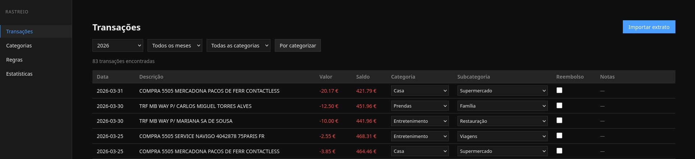
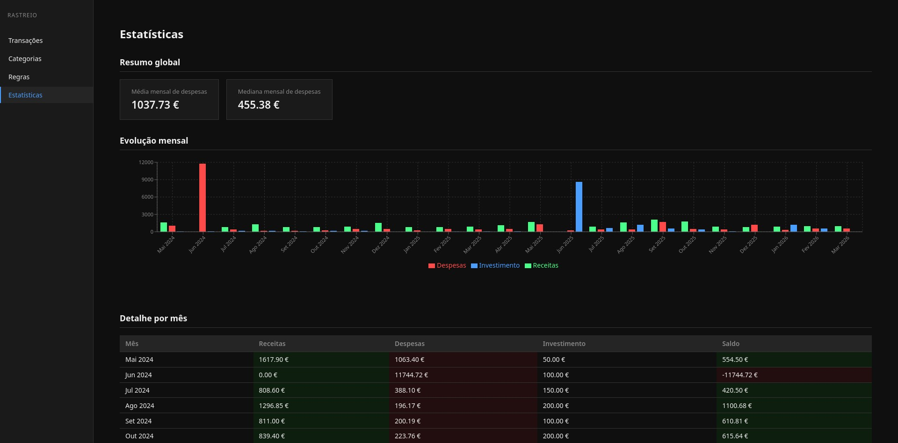
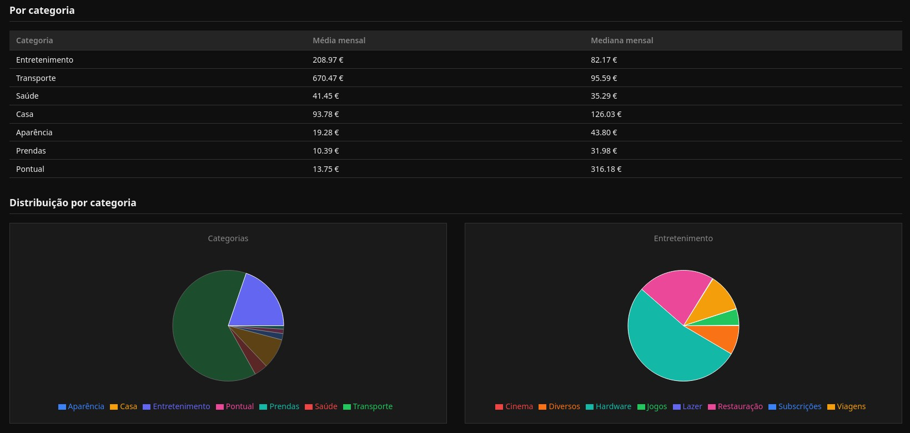

# rastreio-db

Aplicação web para gestão e análise de despesas bancárias pessoais, com foco em categorização automática e representação fiel da realidade financeira.

Permite importar extratos do banco em formato excel, categorizar automaticamente com regras personalizadas e obter estatísticas úteis para um melhor planeamento financeiro.

## Motivação

Este projeto surgiu da necessidade de ter um controlo financeiro fora dos limites e constrangimentos dos ficheiros Excel, mais fiel à realidade, ajustável, mais aprofundado e utilização fácil.

## Preview

### Lista de transações (edição inline + filtros)


### Estatísticas (Mensais, por categoria e subcategorias)



## Tecnologias

- **Backend:** Python 3.14 + FastAPI + SQLAlchemy + SQLite
- **Frontend:** React + Vite
- **Servidor:** Uvicorn
- **Distribuição:** PyInstaller

## Arquitectura
```
rastreio-db/
├── .gitignore
├── README.md
├── DEV.md
├── build.sh                 # Script de build para gerar executável
├── backend/
│   ├── database.py          # Modelos SQLAlchemy e ligação à BD
│   ├── main.py              # Ponto de entrada FastAPI + CORS
│   ├── schemas.py           # Schemas Pydantic para validação de dados
│   ├── popular_bd.py        # Categorias e subcategorias predefinidas
│   ├── migrar_excel.py      # Migração única de dados históricos
│   ├── requirements.txt
│   └── routers/
│       ├── init.py
│       ├── categorias.py    # CRUD de categorias e subcategorias
│       ├── transacoes.py    # Listagem paginada e edição de transações
│       ├── regras.py        # Regras de categorização automática
│       ├── importacao.py    # Importação de extratos Excel do banco
│       ├── backups.py       # Exportação e restauro da base de dados
│       ├── configuracao.py  # Inicialização e estado da aplicação
│       └── estatisticas.py  # Endpoints de estatísticas e resumos
└── frontend/
├── index.html
├── vite.config.js
├── eslint.config.js
├── package.json
└── src/
├── main.jsx
├── App.jsx
├── App.css
├── index.css
├── api/
│   ├── client.js        # Cliente axios centralizado
│   ├── transacoes.js    # Chamadas ao endpoint de transações
│   ├── categorias.js    # Chamadas ao endpoint de categorias
│   ├── regras.js        # Chamadas ao endpoint de regras
│   ├── backups.js       # Chamadas ao endpoint de backups
│   ├── configuracao.js  # Chamadas ao endpoint de configuração
│   └── estatisticas.js  # Chamadas ao endpoint de estatísticas
├── components/
│   ├── TabelaTransacoes.jsx
│   └── FiltrosTransacoes.jsx
└── pages/
├── Transacoes.jsx
├── Transacoes.css
├── Categorias.jsx
├── Categorias.css
├── Regras.jsx
├── Regras.css
├── Estatisticas.jsx
├── Estatisticas.css
└── PrimeiroUso.jsx
```
## Modelo de dados

- **Categoria** — categorias de despesa (Casa, Transporte, Saúde, etc.)
- **Subcategoria** — subdivisão de cada categoria (Supermercado, Combustível, etc.)
- **Transacao** — registo de cada movimento bancário, com categoria, subcategoria, flag de reembolso (tratado como ajuste de despesa em vez de receita) e notas
- **RegraCategorizacao** — regras por palavra-chave ou expressão para categorização automática

## Categorias

| Categoria | Subcategorias |
|---|---|
| Receita | Salário, IRS, Transferência de Poupanças |
| Entretenimento | Lazer, Jogos, Cinema, Viagens, Subscrições, Restauração, Hardware, Diversos |
| Transporte | Combustível, Portagens, Seguro, Manutenção, Carro, IUC, Inspeção |
| Saúde | Consultas, Farmácia, Outros |
| Casa | Renda, Manutenção, Compras, Supermercado |
| Aparência | Roupa, Cabeleireiro |
| Investimento | ETFs, Crypto, Poupança |
| Pontual | Jurídico, Outros |
| Prendas | Família, Namorada |

## Funcionalidades

- Importação de extratos Excel exportados do banco com deteção automática de duplicados por `data + descrição + valor + saldo`
- Categorização automática configurável por regras de palavra-chave, com sugestões durante o uso
- Sugestão de criação de regra ao categorizar manualmente uma transação
- Edição inline de categoria, subcategoria, reembolso e notas diretamente na tabela
- Paginação e filtros por ano, mês e categoria
- Filtro rápido de transações por categorizar
- Aplicação de regras em massa com resolução individual de conflitos
- Estatísticas com resumo mensal, gráfico de evolução, média e mediana de despesas por categoria e distribuição por categoria com drill-down para subcategorias
- Gestão de backups com exportação total da base de dados e restauro com sistema de segurança (auto-backup `.anterior`)
- Ecrã de primeiro uso com inicialização opcional de categorias predefinidas
- Interface web focada em rapidez de edição e análise

## Decisões de design

- Reembolsos são tratados como redução de despesa (evita inflacionar receitas)
- Transferências internas (ex: poupança) são excluídas de métricas de despesa real
- Transações `TRF` (transferências) excluídas da aplicação de regras devido à ambiguidade de contexto
- Sistema de regras baseado em substring para simplicidade e controlo do utilizador
- Base de dados persistente em `dados/rastreio.db` junto ao executável para portabilidade e visibilidade

## Distribuição

A aplicação pode ser gerada como executável portable para Linux, sem necessidade de instalar Python, Node ou outras dependências.

### Gerar o executável

```bash
chmod +x build.sh
./build.sh
```

O executável é gerado em `dist_executavel/`. A base de dados fica em `dist_executavel/dados/rastreio.db` — esta pasta deve ser preservada entre actualizações.

### Primeiro uso

Ao abrir a aplicação pela primeira vez, é apresentado um ecrã de boas-vindas com a opção de carregar as categorias predefinidas.

### Notas

- O build é específico para o sistema operativo onde é executado
- Para Windows, é necessário correr o build numa máquina Windows (suporte planeado)

## Estado actual

### Backend
- [x] Backend completo com todos os endpoints
- [x] Migração de dados históricos
- [ ] Refactor de schema: adicionar campo `tipo` a `Categoria` (valores: `despesa`, `receita`, `investimento`, `transferencia`) e substituir filtragem por `Categoria.nome` em todos os routers

### Páginas
- [x] Transações (tabela, filtros, paginação, importação, edição inline, sugestão de regras com selector de substring)
- [x] Categorias (CRUD de categorias e subcategorias)
- [x] Regras (criação, listagem, remoção e aplicação em massa de regras de categorização)
- [x] Estatísticas
  - [x] Resumo mensal com evolução gráfica
  - [x] Média e mediana por categoria
  - [x] Distribuição por categoria com drill-down para subcategorias
  - [x] Substituir gráficos de distribuição (pie) por gráficos de barras
  - [x] Percentagem na distribuição por categoria e subcategoria
  - [x] Vista detalhada por mês com despesas e receitas por categoria e subcategoria
  - [x] Taxa de poupança por intervalo de tempo (mensal e anual)
  - [x] Totalizadores e estatísticas anuais

### Sistema
- [x] Backup & Restore (exportação, importação com escrita atómica e auto-backup)
- [x] Versão distribuível para Linux (executável portable via PyInstaller)
- [ ] Ícone na system tray para controlo do executável (Linux/Windows)
- [ ] Versão distribuível para Windows
